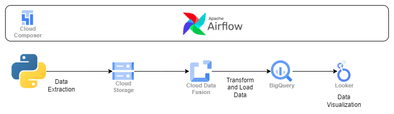

# ETL Project with Data Fusion, Airflow, and BigQuery

1. **Data Extraction**: Extract data using python.
2. **Data Masking**: Apply data masking & encoding techniques to sensitive information in Cloud Data Fusion before loading it into BigQuery.
3. **Data Loading**: Load transformed data into Google BigQuery tables.
4. **Orchestration**: Automate complete Data pipeline using Airflow ( Cloud Composer )

